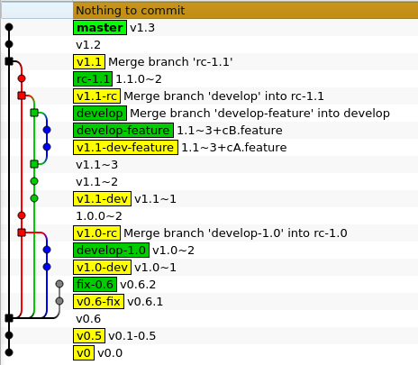

# git-auto-version
A tool to automatically build version number from git

## Versioning
```
  A.B{.C|~DEV|.0~RC}[.gNNNNNNN+cCCCC.FFFF].gMMMMMMM+dDDDD

  Where:
  A             Major
  B             Minor
  C             Revision
  DEV           Development step
  RC            Release candidate step
  [  Exists only if feature/developer fork from develop
  gNNNNNNN      git hash of fork commit
  cCCCC         Time difference in seconds between fork commit and HEAD
  FFFF          Feature/developer name
  ]
  gMMMMMMM      git hash of HEAD
  dDDDD         Time difference in seconds between last modified file and HEAD
```

## Example


## Usage
```
Usage: git auto-version [command]
Will print current version if no command specified
Commands:
  help                  - print this help
  init                  - init new repo and create .git/hooks/post-commit
  fix                   - create new branch fix-<current version> for fixes
  develop [new version] - create new branch develop-<new version> for development
  feature <feature>     - create new feature develop-<version>-<feature>
  rc [new version]      - create new branch rc-<current version> for release
  rc from <develop-VER> - create new branch rc-<VER> for release
  release from <rc-VER> - merge RC branch
  mktag [num]           - create tag
  mkversion [num]       - create main version tag
  archive [name]        - create archive name-<current version>.tgz

Versioninig hints:
  master:  tag vM           => M.N
  fix:     tag vM.N-fix     => M.N.FIX
  rc:      tag vM.N-rc      => M.N.0~RC
  develop: tag vM.N-dev     => M.N~DEV
  feature: tag vM.N-dev-(*) => M.N~DEV.GIT+TIME.(*)
                            => .GIT[+DIRTY_TIME]
```
